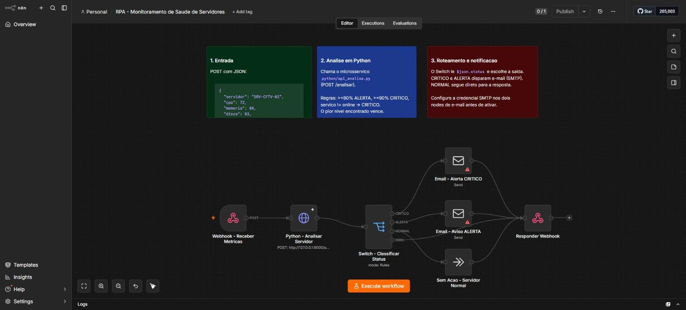
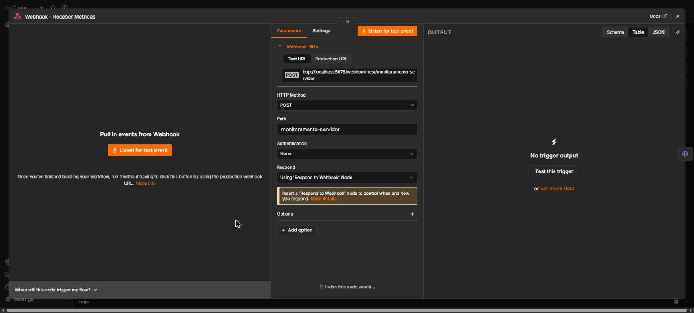
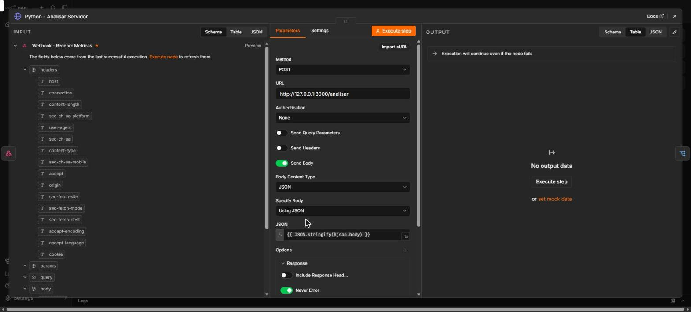
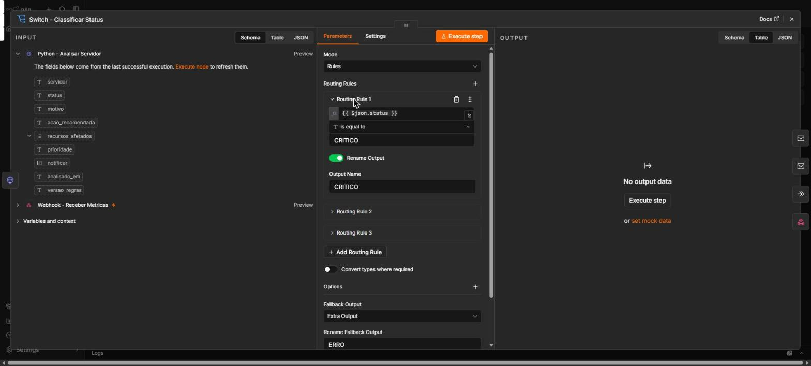
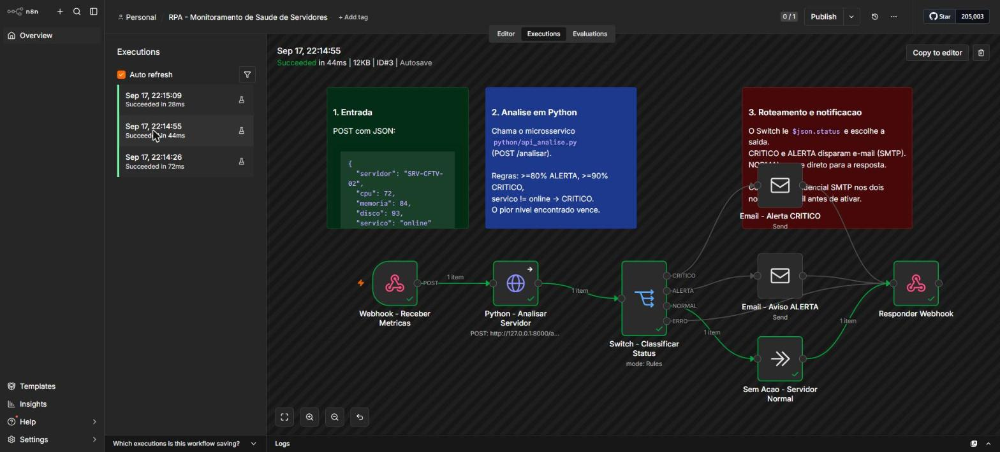
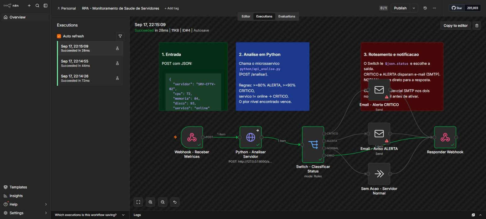

# RPA de Monitoramento e Análise Automática de Saúde de Servidores

> Processo de RPA construído com **N8N + Python** para receber métricas de servidores via Webhook, classificar automaticamente a criticidade e notificar a equipe de infraestrutura por e-mail.
>
> Projeto desenvolvido como entrega do desafio **“Criando um Processo de RPA com N8N e Python”** — Bootcamp **Santander – Automação com N8N** (DIO).

<p align="left">
  
  
  
  
  
</p>

---

## Índice

1. [Descrição](#1-descrição)
2. [Objetivo](#2-objetivo)
3. [Problema que a automação resolve](#3-problema-que-a-automação-resolve)
4. [Tecnologias utilizadas](#4-tecnologias-utilizadas)
5. [Arquitetura da solução](#5-arquitetura-da-solução)
6. [Explicação do workflow](#6-explicação-do-workflow)
7. [Explicação da utilização do Python](#7-explicação-da-utilização-do-python)
8. [Exemplos de entrada e saída](#8-exemplos-de-entrada-e-saída)
9. [Cenários de teste](#9-cenários-de-teste)
10. [Como executar o projeto](#10-como-executar-o-projeto)
11. [Estrutura do repositório](#11-estrutura-do-repositório)
12. [Melhorias futuras](#12-melhorias-futuras)
13. [Conclusão](#13-conclusão)

---

## 1. Descrição

Este projeto implementa um **RPA (Robotic Process Automation)** que automatiza uma
das tarefas mais repetitivas — e mais críticas — de uma equipe de infraestrutura:
**olhar métricas de servidor, decidir se aquilo é problema e avisar alguém.**

### Cenário fictício

A **CondoTech Sistemas** é uma empresa (fictícia) que fornece e mantém a
infraestrutura tecnológica de condomínios residenciais: portaria eletrônica,
CFTV, aplicativo do morador e o banco de dados que sustenta tudo isso.

Cada condomínio atendido tem quatro servidores:

| Servidor | Função |
|---|---|
| `SRV-PORTARIA-01` | Controle de acesso e interfone da portaria |
| `SRV-CFTV-02` | Gravação e retenção das imagens das câmeras |
| `SRV-APP-03` | API do aplicativo do morador (reservas, avisos, boletos) |
| `SRV-BD-04` | Banco de dados central |

Com dezenas de condomínios atendidos, a equipe não consegue olhar todos os
painéis todos os dias. É essa vigilância que o RPA assume.

### Como funciona

O N8N expõe um **Webhook HTTP** que recebe as métricas coletadas de um servidor
(CPU, memória, disco e status do serviço). Um **microsserviço em Python**
aplica as regras de capacity planning, classifica o servidor em
`NORMAL`, `ALERTA` ou `CRITICO`, monta o motivo e a ação recomendada, e devolve
um JSON estruturado. Um **Switch** roteia o resultado e dispara a notificação por
**e-mail (SMTP)** apenas quando existe um problema real.

O agente que coleta as métricas pode ser qualquer coisa: um script de crontab,
um `curl` no fim de um job, Zabbix, Prometheus Alertmanager ou até outro
workflow do N8N. O contrato é apenas o JSON do webhook.



<p align="center"><sub>O workflow completo no editor do N8N.</sub></p>

---

## 2. Objetivo

- Demonstrar, na prática, a integração **N8N ↔ Python** dentro de um processo de RPA.
- Centralizar em **um único ponto** a regra de negócio que define o que é
  “servidor saudável”, “servidor em atenção” e “servidor em incidente”.
- Eliminar a triagem manual: a equipe só é acionada quando existe algo a fazer.
- Entregar uma automação **reprodutível**, versionada e documentada, que sirva
  tanto como entrega educacional quanto como peça de portfólio.

---

## 3. Problema que a automação resolve

O servidor de CFTV é o exemplo perfeito: câmeras gravando 24 horas por dia
enchem o disco de forma silenciosa e previsível. Quando alguém percebe,
a gravação já parou — e justamente no dia em que o condomínio precisa da imagem.

O cenário manual típico:

| Dor | Consequência |
|---|---|
| Métricas espalhadas em painéis diferentes | Ninguém olha todos os dias |
| Triagem manual (“isso é grave?”) | Depende da experiência de quem está de plantão |
| Critério informal de severidade | Duas pessoas classificam o mesmo evento de formas diferentes |
| Aviso por WhatsApp/verbal | Sem rastro, sem histórico, sem SLA |
| Alerta para tudo | Fadiga de alerta — o time passa a ignorar |

O que esta automação entrega:

- **Critério objetivo e versionado.** O limiar está no código, não na cabeça do analista.
- **Triagem em milissegundos**, 24×7, sem intervenção humana.
- **Ação recomendada junto do alerta** — o e-mail já diz o que fazer.
- **Notificação só quando importa.** Servidor `NORMAL` não gera e-mail.
- **Priorização automática** (P1 / P2 / P4) pronta para virar chamado.

---

## 4. Tecnologias utilizadas

| Tecnologia | Papel no projeto |
|---|---|
| **N8N 2.x** | Orquestração do RPA: webhook, roteamento, notificação e resposta HTTP |
| **Python 3.10+** | Motor de análise e classificação (regras de negócio) |
| **`http.server` (stdlib)** | Microsserviço HTTP que expõe o motor — **zero dependências** |
| **Node HTTP Request** | Ponte entre o N8N e o serviço Python |
| **Node Send Email (SMTP)** | Canal de notificação da equipe de infraestrutura |
| **Webhook / HTTP POST** | Contrato de entrada — desacopla o coletor do analisador |
| **unittest** | 14 testes automatizados cobrindo as regras e as bordas |

---

## 5. Arquitetura da solução

```text
┌──────────────────────┐
│  Agente coletor      │   crontab / Zabbix / health check / script de deploy
│  (fora deste repo)   │
└──────────┬───────────┘
           │  HTTP POST  { servidor, cpu, memoria, disco, servico }
           ▼
┌─────────────────────────────────────────────────────────────────────────┐
│                                 N8N                                     │
│                                                                         │
│  ① Webhook ──▶ ② HTTP Request ──▶ ③ Switch ──┬──▶ ④ E-mail P1 (CRÍTICO) │
│   recebe            │                        ├──▶ ⑤ E-mail P2 (ALERTA)  │
│                     │                        ├──▶ ⑥ NoOp (normal)       │
│                     │                        └──▶ (fallback ERRO)       │
│                     │                                   │               │
│                     │              ⑦ Respond to Webhook ◀┘              │
└─────────────────────┼───────────────────────────────────────────────────┘
                      │  POST /analisar
                      ▼
      ┌───────────────────────────────────┐
      │   MICROSSERVIÇO PYTHON            │
      │   python/api_analise.py  :8000    │
      │   ───────────────────────────     │
      │   analisar_servidor.py            │
      │   • valida e normaliza            │
      │   • aplica os limiares            │
      │   • classifica e prioriza         │
      │   • monta motivo + ação + msg     │
      └───────────────────────────────────┘
```

**Fluxo em uma linha:**
`Webhook → N8N → Python → Análise → Classificação → N8N → Notificação/Relatório`

### Por que microsserviço e não o Code node em Python?

Esta foi uma decisão de projeto tomada **depois de testar as três alternativas**
numa instalação real do N8N 2.31 (npm, Windows):

| Abordagem | Resultado no teste | Observação |
|---|---|---|
| **Code node — Python** | ❌ `Python runner unavailable: Virtual environment is missing` | A partir do N8N 2.x o Python do Code node depende do pacote `@n8n/task-runner-python` e de um virtualenv gerenciado, que não vem pronto em instalação npm |
| **Execute Command** | ❌ `Unrecognized node type` | O node foi retirado do conjunto padrão no N8N 2.0 por segurança; volta só via `N8N_NODES_INCLUDE` |
| **Microsserviço + HTTP Request** | ✅ Funciona | Usa o node mais universal do N8N; independe de versão, de flag e de sistema operacional |

Além de simplesmente funcionar, a abordagem escolhida tem vantagens reais:

- **Independência de versão.** O `HTTP Request` existe em todas as versões do N8N.
- **Python de verdade.** É o interpretador do sistema, com acesso a qualquer
  biblioteca (`psutil`, `pandas`, `requests`) — não a um sandbox limitado.
- **Testável isoladamente.** Dá para rodar `curl` contra a API sem abrir o N8N.
- **Escalável.** O mesmo serviço pode atender outros workflows, outros sistemas
  ou virar um container próprio, sem tocar no N8N.

---

## 6. Explicação do workflow

O workflow tem **7 nodes funcionais** (+ 3 sticky notes de documentação).
O guia completo, node por node — com todos os campos, expressions, dados de
entrada e dados de saída — está em **[`docs/PASSO-A-PASSO.md`](docs/PASSO-A-PASSO.md)**.

Resumo:

| # | Node | Tipo | Para que serve |
|---|---|---|---|
| ① | `Webhook - Receber Metricas` | `Webhook` | Expõe `POST /webhook/monitoramento-servidor` e entrega o payload em `$json.body` |
| ② | `Python - Analisar Servidor` | `HTTP Request` | Envia as métricas para o microsserviço Python e recebe o diagnóstico |
| ③ | `Switch - Classificar Status` | `Switch` | Lê `$json.status` e escolhe a saída: CRITICO / ALERTA / NORMAL / ERRO |
| ④ | `Email - Alerta CRITICO` | `Send Email` | Dispara o e-mail P1 com assunto `[P1 - CRITICO] ...` |
| ⑤ | `Email - Aviso ALERTA` | `Send Email` | Dispara o e-mail P2 com assunto `[P2 - ALERTA] ...` |
| ⑥ | `Sem Acao - Servidor Normal` | `No Operation` | Caminho “tudo certo” — não notifica, só segue para a resposta |
| ⑦ | `Responder Webhook` | `Respond to Webhook` | Devolve o diagnóstico completo em JSON para quem chamou |

### ① Webhook — o contrato de entrada



<p align="center"><sub>Método <code>POST</code>, path <code>monitoramento-servidor</code> e <code>Respond: Using 'Respond to Webhook' Node</code>.</sub></p>

### ② HTTP Request — a ponte para o Python



<p align="center"><sub><code>POST http://127.0.0.1:8000/analisar</code> com o corpo montado pela expression <code>{{ JSON.stringify($json.body) }}</code>.</sub></p>

### ③ Switch — o roteamento por severidade



<p align="center"><sub>Três regras sobre <code>{{ $json.status }}</code> mais a saída de fallback <code>ERRO</code>.</sub></p>

---

## 7. Explicação da utilização do Python

Todo o **cérebro** da automação está em Python. O N8N cuida do transporte
(receber, rotear, enviar); o Python cuida da **decisão**.

| Arquivo | Papel |
|---|---|
| [`python/analisar_servidor.py`](python/analisar_servidor.py) | Motor de análise: valida, classifica, prioriza e monta a mensagem. Funciona como biblioteca e como CLI |
| [`python/api_analise.py`](python/api_analise.py) | Microsserviço HTTP (`http.server` da stdlib) que expõe o motor em `POST /analisar` |
| [`python/test_analisar_servidor.py`](python/test_analisar_servidor.py) | 14 testes unitários das regras e das bordas |

A separação é proposital: **a regra de negócio não sabe que existe HTTP**, e a
camada HTTP não sabe nada sobre limiares. Dá para reaproveitar o motor num
script de crontab, numa Lambda ou num job de CI sem mudar uma linha.

### Regras de classificação

```text
Recursos (cpu, memoria, disco), em %:
    valor < 80      →  NORMAL
    80 ≤ valor < 90 →  ALERTA
    valor ≥ 90      →  CRITICO

Status do serviço:
    online / running / ativo        →  NORMAL
    degradado / degraded / lento    →  ALERTA
    offline / parado / error / ...  →  CRITICO
    valor desconhecido              →  CRITICO   (fail-safe)

Status final do servidor = PIOR nível encontrado entre as 4 dimensões.
O campo "motivo" agrega TODAS as ocorrências daquele nível.
```

Exemplo de agregação: CPU 85% (`ALERTA`) + disco 97% (`CRITICO`) → status final
`CRITICO`, e o motivo cita apenas o disco. Já CPU 95% + disco 99% → `CRITICO`
com os dois recursos no motivo.

### O que o Python devolve

Além dos 4 campos exigidos pelo desafio (`servidor`, `status`, `motivo`,
`acao_recomendada`), a saída traz campos que tornam a automação utilizável de
verdade:

| Campo | Para que serve |
|---|---|
| `recursos_afetados` | Lista os recursos que dispararam o status — útil para métricas |
| `prioridade` | `P1` / `P2` / `P4`, pronto para abrir chamado |
| `notificar` | Booleano — permite um IF simples em vez de comparar strings |
| `metricas` | Ecoa os valores normalizados (aceita `72`, `"72"` e `"72%"`) |
| `analisado_em` | Timestamp UTC ISO-8601, para auditoria |
| `versao_regras` | Versão do motor que gerou aquele diagnóstico |
| `mensagem` | Texto do alerta **já formatado** — o e-mail vira uma expression de 1 linha |

### Tratamento de erro

Payload inválido **não derruba o workflow**. A API responde `HTTP 200` com
`status: "ERRO"` e a descrição do problema. Esse item cai na saída de *fallback*
do Switch e retorna ao chamador — sem gerar e-mail falso-positivo.

Se a própria API estiver fora do ar, o node HTTP Request está configurado com
`onError: continueRegularOutput`, então o erro também segue pelo caminho `ERRO`
em vez de quebrar a execução.

---

## 8. Exemplos de entrada e saída

### Entrada (POST no webhook)

```json
{
  "servidor": "SRV-CFTV-02",
  "cpu": 72,
  "memoria": 84,
  "disco": 93,
  "servico": "online"
}
```

### Saída (resposta HTTP do workflow)

```json
{
  "servidor": "SRV-CFTV-02",
  "status": "CRITICO",
  "motivo": "Utilizacao de disco em 93% (limite critico: 90%).",
  "acao_recomendada": "Verificar espaco disponivel e realizar limpeza do servidor (logs antigos, dumps, imagens temporarias). Avaliar expansao do volume.",
  "recursos_afetados": ["disco"],
  "prioridade": "P1",
  "notificar": true,
  "metricas": { "cpu": 72.0, "memoria": 84.0, "disco": 93.0, "servico": "online" },
  "analisado_em": "2026-09-18T01:03:38+00:00",
  "versao_regras": "1.0.0",
  "mensagem": "ALERTA DE MONITORAMENTO\nServidor: SRV-CFTV-02\n..."
}
```

### E-mail recebido pela equipe

**Assunto:** `[P1 - CRITICO] SRV-CFTV-02 - acao imediata necessaria`

```text
ALERTA DE MONITORAMENTO
Servidor: SRV-CFTV-02
Status: CRITICO
CPU: 72%
Memoria: 84%
Disco: 93%
Servico: online

Problema identificado:
Utilizacao de disco em 93% (limite critico: 90%).

Acao recomendada:
Verificar espaco disponivel e realizar limpeza do servidor (logs antigos,
dumps, imagens temporarias). Avaliar expansao do volume.

Prioridade: P1 | Analisado em (UTC): 2026-09-18T01:03:38+00:00
```

<!-- Screenshot do e-mail recebido: adicione images/email-alerta.png e descomente a linha abaixo

-->

---

## 9. Cenários de teste

Os payloads estão em [`examples/`](examples/) e podem ser disparados de uma vez
com [`examples/testar-webhook.sh`](examples/testar-webhook.sh).

### Cenário 1 — NORMAL

App do morador operando dentro dos limites. **Não gera e-mail.**

```json
{ "servidor": "SRV-APP-03", "cpu": 35, "memoria": 48, "disco": 61, "servico": "online" }
```

**Esperado:** `status: NORMAL` · `prioridade: P4` · `notificar: false` · saída ③ do Switch → NoOp.

### Cenário 2 — ALERTA

Banco de dados com memória em 84% — acima do limiar de atenção, abaixo do crítico.

```json
{ "servidor": "SRV-BD-04", "cpu": 66, "memoria": 84, "disco": 72, "servico": "online" }
```

**Esperado:** `status: ALERTA` · `prioridade: P2` · e-mail `[P2 - ALERTA]`.

### Cenário 3 — CRÍTICO

Servidor de CFTV com disco em 93%: a gravação das câmeras está prestes a parar.

```json
{ "servidor": "SRV-CFTV-02", "cpu": 72, "memoria": 84, "disco": 93, "servico": "online" }
```

**Esperado:** `status: CRITICO` · `prioridade: P1` · e-mail `[P1 - CRITICO]`.
Note que a memória em 84% (ALERTA) é *ofuscada* pelo disco: o pior nível vence.

### Cenário 4 — CRÍTICO por serviço indisponível *(bônus)*

Portaria com recursos saudáveis, mas o serviço caiu — ninguém entra no condomínio.

```json
{ "servidor": "SRV-PORTARIA-01", "cpu": 12, "memoria": 22, "disco": 40, "servico": "offline" }
```

**Esperado:** `status: CRITICO` por causa do serviço, mesmo com métricas baixas.

### Cenário 5 — Payload inválido *(bônus)*

```json
{ "servidor": "SRV-APP-03", "cpu": 55, "memoria": 60 }
```

**Esperado:** `status: ERRO`, motivo `Campos obrigatorios ausentes: disco, servico`,
saída de fallback do Switch, **sem e-mail**.

### Testes automatizados

```bash
python3 -m unittest discover -s python -v
```

```text
Ran 14 tests in 0.001s
OK
```

### Execuções reais no N8N

**Cenário NORMAL** — o item percorre `Switch → NORMAL → Sem Acao` e vai direto para a resposta, sem tocar nos nodes de e-mail:



**Cenário de payload inválido** — a API devolve `status: ERRO`, e o Switch manda o item pela saída de fallback, também sem gerar e-mail:



---

## 10. Como executar o projeto

### Pré-requisitos

- **N8N** (Docker, npm ou Cloud)
- **Python 3.10+**
- Uma conta **SMTP** (Gmail com senha de app, Outlook, Mailtrap, etc.)

Nenhum `pip install` é necessário: a API usa apenas a biblioteca padrão.

### Passo 1 — Subir o microsserviço Python

```bash
# Windows
iniciar-api.bat

# Linux / macOS
./iniciar-api.sh

# ou, em qualquer sistema
python3 python/api_analise.py
```

Saída esperada:

```text
==============================================================
  API de analise de saude de servidores
  Escutando em    http://127.0.0.1:8000
  Health check    http://127.0.0.1:8000/saude
  Analise (POST)  http://127.0.0.1:8000/analisar
  Ctrl+C para encerrar
==============================================================
```

Confira com `curl http://127.0.0.1:8000/saude`.
**Deixe esse terminal aberto** enquanto usar o workflow.

### Passo 2 — Subir o N8N

```bash
npx n8n
```

Ou com Docker:

```bash
docker volume create n8n_data
docker run -d --name n8n -p 5678:5678 \
  -v n8n_data:/home/node/.n8n \
  -e GENERIC_TIMEZONE="America/Sao_Paulo" -e TZ="America/Sao_Paulo" \
  docker.n8n.io/n8nio/n8n
```

> ⚠️ **Duas armadilhas de rede que já custaram tempo neste projeto:**
>
> 1. **Use `127.0.0.1`, não `localhost`.** No Windows o Node.js resolve
>    `localhost` para o IPv6 `::1`, enquanto a API Python escuta em IPv4 — o
>    resultado é `ECONNREFUSED ::1:8000`. O workflow já vem com `127.0.0.1`.
> 2. **N8N em Docker com a API no host:** troque a URL para
>    `http://host.docker.internal:8000` — dentro do container, `127.0.0.1` é o
>    próprio container.

Acesse `http://localhost:5678`.

### Passo 3 — Importar o workflow

1. No N8N: menu **⋯ → Import from File**
2. Selecione `workflow/monitoramento-servidor.json`
3. O canvas aparece com os 7 nodes já conectados

### Passo 4 — Configurar a credencial SMTP

1. **Credentials → Add credential → SMTP**
2. Preencha (exemplo Gmail):

   | Campo | Valor |
   |---|---|
   | User | `seu-email@gmail.com` |
   | Password | senha de app (16 caracteres) — **não** a senha da conta |
   | Host | `smtp.gmail.com` |
   | Port | `465` |
   | SSL/TLS | ativado |

3. Abra os nodes **`Email - Alerta CRITICO`** e **`Email - Aviso ALERTA`**, selecione
   a credencial criada e ajuste `From Email` / `To Email`.

> ⚠️ Nunca comite credenciais. O N8N exporta apenas a referência à credencial,
> nunca a senha — mas confira o JSON antes do `git push`.

### Passo 5 — Testar

1. Clique em **Execute workflow** (o webhook de teste fica escutando)
2. Dispare os cenários:

```bash
chmod +x examples/testar-webhook.sh
./examples/testar-webhook.sh http://localhost:5678/webhook-test/monitoramento-servidor
```

Ou um por vez:

```bash
curl -X POST http://localhost:5678/webhook-test/monitoramento-servidor \
     -H "Content-Type: application/json" \
     -d @examples/servidor_critico.json
```

### Passo 6 — Ativar em produção

Salve o workflow e ligue o toggle **Active**. A URL de produção passa a ser
`http://localhost:5678/webhook/monitoramento-servidor` (sem o `-test`).

### Rodar o motor Python fora do N8N

```bash
# argumentos nomeados
python3 python/analisar_servidor.py --servidor "SRV-CFTV-02" --cpu 72 \
        --memoria 84 --disco 93 --servico online

# JSON via stdin
cat examples/servidor_critico.json | python3 python/analisar_servidor.py

# testes
python3 -m unittest discover -s python -v
```

### Regenerar o workflow após alterar URLs ou e-mails

```bash
python3 docs/gerar_workflow.py
```

---

## 11. Estrutura do repositório

```text
rpa-monitoramento-n8n-python/
│
├── README.md                          # Esta documentação
├── LICENSE                            # Licença MIT
├── .gitignore
├── iniciar-api.bat                    # Sobe a API no Windows
├── iniciar-api.sh                     # Sobe a API no Linux/macOS
│
├── workflow/
│   └── monitoramento-servidor.json    # Workflow pronto para importar no N8N
│
├── python/
│   ├── analisar_servidor.py           # Motor de análise (biblioteca + CLI)
│   ├── api_analise.py                 # Microsserviço HTTP (stdlib, sem deps)
│   └── test_analisar_servidor.py      # 14 testes unitários
│
├── examples/
│   ├── servidor_normal.json           # Cenário 1
│   ├── servidor_alerta.json           # Cenário 2
│   ├── servidor_critico.json          # Cenário 3
│   ├── servidor_servico_offline.json  # Cenário 4 (bônus)
│   ├── payload_invalido.json          # Cenário 5 (bônus)
│   └── testar-webhook.sh              # Dispara todos os cenários de uma vez
│
├── docs/
│   ├── PASSO-A-PASSO.md               # Guia node por node (construção manual)
│   ├── CHECKLIST-ENTREGA.md           # Checklist antes de entregar
│   └── gerar_workflow.py              # Gera o JSON do workflow
│
└── images/
    ├── workflow-n8n.png               # Canvas completo
    ├── node-webhook.png               # Node Webhook configurado
    ├── node-http-request.png          # Node HTTP Request chamando o Python
    ├── node-switch.png                # Switch com as 4 saídas
    ├── execucao-normal.png            # Execução do cenário NORMAL
    └── execucoes.png                  # Execução do cenário ERRO
```

---

## 12. Melhorias futuras

**Curto prazo**

- Persistir cada análise em banco (PostgreSQL/MySQL) para histórico e SLA.
- Adicionar canal Telegram/Slack em paralelo ao e-mail.
- Autenticar o webhook (Header Auth) e a API (token) para impedir chamadas não autorizadas.
- Empacotar a API em um `Dockerfile` e subir junto do N8N via `docker compose`.

**Médio prazo**

- **Deduplicação de alertas**: não reenviar o mesmo alerta antes de N minutos.
- **Limiares por servidor**, vindos de uma tabela de configuração — um servidor de
  banco tolera memória alta; um de CFTV, não.
- **Alerta de tendência**: disparar quando o disco cresce X% ao dia, antes de
  chegar a 90%.
- Dashboard (Grafana/Metabase) sobre o histórico gravado.

**Longo prazo**

- Detecção de anomalia por baseline estatístico em vez de limiar fixo.
- **Auto-remediação**: para casos seguros e conhecidos (rotacionar log, limpar
  gravações expiradas do CFTV), executar a ação e só então notificar o que foi feito.
- Agente coletor próprio (`psutil`) empacotado para instalação na frota.

---

## 13. Conclusão

O projeto mostra, de ponta a ponta, o padrão que torna o N8N poderoso em
automações de infraestrutura: **o N8N orquestra, o Python decide.**

O N8N resolve com zero código o que é chato de escrever — servidor HTTP,
roteamento condicional, envio de e-mail, retries, logging de execução. O Python
resolve o que ferramenta visual faz mal — regra de negócio com condições
compostas, priorização e texto dinâmico. Cada camada faz o que faz melhor, e o
resultado é uma automação que dá para ler, testar e evoluir.

A escolha de expor o Python como **microsserviço HTTP**, em vez de embutir o
código dentro do N8N, nasceu de um problema real durante a construção (o Code
node em Python e o Execute Command não estavam disponíveis na versão instalada)
e acabou virando a melhor decisão do projeto: desacoplou a regra de negócio da
ferramenta de automação. Hoje o motor de análise pode ser chamado pelo N8N,
por um crontab ou por qualquer outro sistema — e continua com seus 14 testes
rodando em menos de um segundo.

---

## Licença

Distribuído sob a licença MIT. Veja [`LICENSE`](LICENSE).

## Autor

**Gabriel Felipe Santana**

[](https://github.com/GabrielFSantana)

---

<sub>Desafio de projeto — Bootcamp Santander Automação com N8N · Digital Innovation One (DIO)</sub>
<sub><br>A CondoTech Sistemas e os condomínios citados são fictícios, criados apenas para dar contexto ao exercício.</sub>
